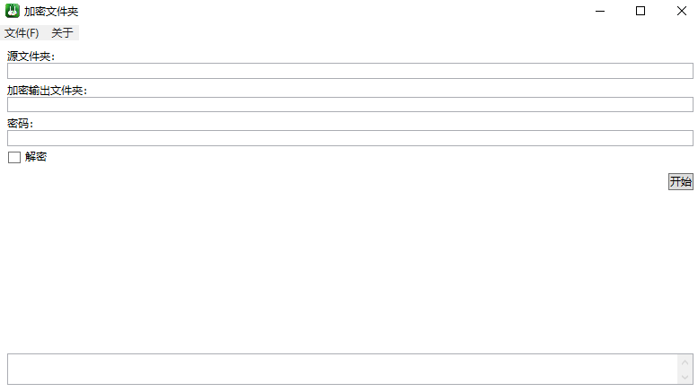

# 私密密码本

本仓库包含了多个部分，分别是：

- EncryptionAlgorithm：加密算法部分
- App：应用部分

## 加密算法

加密算法为我编写的加密算法，这是对[此前我编写的基于哈希的加密算法](http://www.cnki.com.cn/Article/CJFDTotal-KXTS201709009.htm)的实现。具备加密解密和部分混淆的能力。加密强度一般，理论上也属于可破的密码算法，但是破解较为困难。由于加密算法相对小众，小众能提供一点点的安全性，给攻击者多挖点坑

在不泄露自己的密码的前提下，如不基于统计学，将难以分辨有效信息和填补的垃圾

此加密算法比较难防暴破，由于解密性能较好，算法复杂度低，因此暴力破解是可行的。但如果密码就随意写一串中文，在不进行社工破解的前提下，暴力破解还是有点难度的

加密算法的实现完全开源，可以方便进行调用。有二进制加密版本和专门应对字符串的字符串加密版本。我比较推荐使用二进制加密的版本，任何字符串都可以进行编码，如 UTF16 编码等编码为二进制进行二进制加密

使用方法如下：

```csharp
using Lindexi.Src.EncryptionAlgorithm;

// 加密
// 例如有明文 text 字符串，即可编码为二进制数组进行加密
var textData = Encoding.UTF8.GetBytes(text);
// 定义密码，密码是 int 数组，使用中文作为密码也是可以的
int[] key = new int[]
{
    '林',
    '德',
    '熙'
};

var byteList = BinaryEncryption.Encrypt(textData, key);

// 解密
// 对以上的 byteList 进行解密
var decryptionData = BinaryEncryption.Decrypt(byteList, key);
// 再还原字符串
var decryptionText = Encoding.UTF8.GetString(decryptionData);
```

## 应用

### 私密密码本

对文本内容进行加密的应用，可以用来当成密码本


### 加密文件夹

我想要将一些带有隐私信息的文件夹进行同步到网盘。但是现在各个网盘都是不可信的，我就想着将文件夹的内容加密之后再同步。于是就基于以上的加密算法编写了文件夹加密工具。此加密工具可以将一个输入的文件夹的内容，进行加密，每个文件独立加密之后输出到输出文件夹里面。于是将加密输出文件夹同步到网盘等，就不怕信息泄露了。因为如果没有对应的密码，那是难以还原出来原本文件的内容的



发布版本： [EncryptionDirectory.Wpf.1.0.0](https://github.com/lindexi/encryption_code_book/releases/tag/EncryptionDirectory.Wpf.1.0.0)